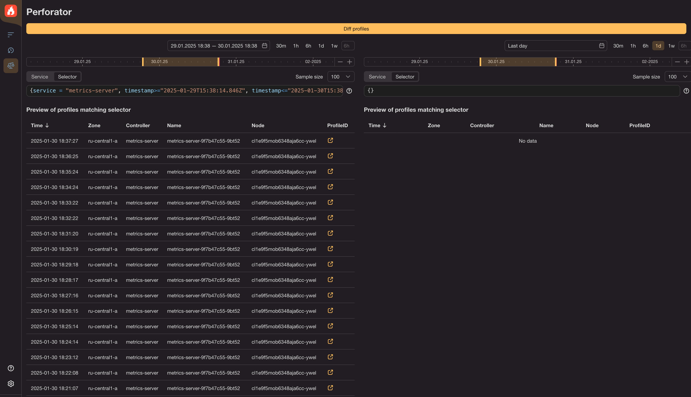
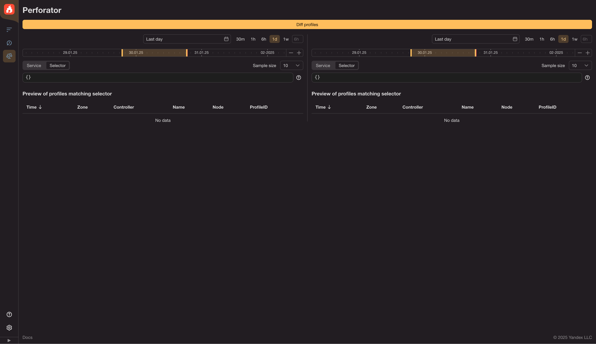

# How to find difference betweeen two flamegraphs

Perforator can help you find differences between two profiles. There can be multiple different situations where you might want to compare profiles.

It can help to answer different questions such as: 
- did your optimization actually help?
- did the service performance degrade due to recent code changes?
- does the new runtime version make things faster or slower?

## Selectors

Fundamentally, a diff requires two selectors: baseline selector and a new one (diff) selector.

A baseline will probably be using data from the past, or be the old version on blue/green deployment.

## Building base selector

### Option 1: There is a flamegraph that might be used as a base

You have already built one profile and want to compare it.

Open the flamegraph and click the "Compare with" button, you will get redirected to a comparison page. It looks like two main pages side by side. The left hand side will be pre-filled with the selector from the profile you've been seeing just yet.

On the right hand side, enter the new selector for comparison.

### Option 2: Building base selector from scratch

This is the option you need if you only know the service name or the first option is not applicable for some other reason.

Go to diffs page marked on the toolbar with scales icon.

There you'll have to build a selector for baseline (on the left) and new (on the right).

### Fine-tuning the selectors

By this point, you should have both selectors and see two lists of profiles that match them.

Also note, that if you have used a small sample number for the base profile you might want to adjust it on both sides.

Selectors use the [perforator query language](../reference/querylang.md) format.

Configure selectors on the right and on the left.

Once you're happy with the selectors, click "Diff profiles" button.

# Interpreting diff flamegraph

Contrary to the standard flamegraph, the color carries additional information. The blue shades show decrease of the function cycles, while the shades of red show growth against baseline. The darker the color — the bigger the difference. If the difference is less than 0.1%, the color switches to white.